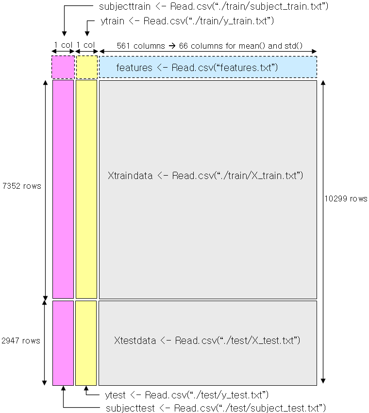

README 
===================================
1. Overview 
-----------------------
The purpose of this project("run_analysis.R") is to prepare tidy data that can 
be used for later analysis. There are 4 files including this file you can refer to as follows.
* README.md :  General description of the data and processing describing how the script works. 
* run_analysis.R : R code file(R script file)
* tidydata.txt : output file generated by run_analysis.R 
* CodeBook.md : code book that describes the variables, the data, and any transformations or work that you performed to clean up the data

2. Background information
------------------------
One of the most exciting areas in all of data science right now is wearable computing - see for example this article(http://www.insideactivitytracking.com/data-science-activity-tracking-and-the-battle-for-the-worlds-top-sports-brand/). Companies like Fitbit, Nike, and Jawbone Up are racing to develop the most advanced algorithms to attract new users. The data linked to from the course website represent data collected from the accelerometers from the Samsung Galaxy S smartphone. A full description is available at the site where the data was obtained:

http://archive.ics.uci.edu/ml/datasets/Human+Activity+Recognition+Using+Smartphones

Here are the data for the project:

https://d396qusza40orc.cloudfront.net/getdata%2Fprojectfiles%2FUCI%20HAR%20Dataset.zip

So, after downloading zip file from above site, unzip this file to current working directory and rearrange directory and file lists based on 3.1 Input below. And load run_analysis.R using script below and check the output file name "tinydata.txt" produced as the processing result.

```
source("run_analysis.R")
```

3. R script : Input, Output and the Processing script
--------------------------------------------------
This run_analysis.R assumes that the Samsung data is in current working directory.
The output is the tidy data so finally "tidydata.txt" is generated in current working directory. 

### 3.1 Input
1. ./train/X_train.txt
2. ./train/y_train.txt
3. ./train/subject_train.txt
4. ./test/X_test.txt
5. ./test/y_test.txt
6. ./test/subject_test.txt
7. ./features.txt
8. ./activity_label.txt

### 3.2 Output
* ./tidydata.txt

### 3.3 flow of script 
Overall flow is as follows. And to understand overall data processing structure, refer to following diagram.


#### 1. Load and Merges the training and the test sets to create one data set which is an allXdata data frame( 10299 rows and 561 columns ).
 * load 8 data sets into corresponding data frame. 
 
 ```
Xtestdata <- read.csv("./test/X_test.txt", header=FALSE, sep="", stringsAsFactors=FALSE)
ytest <- read.csv("./test/y_test.txt", header=FALSE, sep="", stringsAsFactors=FALSE)
subjecttest <- read.csv("./test/subject_test.txt", header=FALSE, sep="", stringsAsFactors=FALSE)
Xtraindata <- read.csv("./train/X_train.txt", header=FALSE, sep="", stringsAsFactors=FALSE)
ytrain <- read.csv("./train/y_train.txt", header=FALSE, sep="", stringsAsFactors=FALSE)
subjecttrain <- read.csv("./train/subject_train.txt", header=FALSE, sep="", stringsAsFactors=FALSE)
activitylabels <- read.csv("./activity_labels.txt", header=FALSE, sep="", stringsAsFactors=FALSE)
features <- read.csv("./features.txt", header=FALSE, sep="", stringsAsFactors=FALSE)
 ```
 * Merges the training and the test sets to create one data set.
 
 ```
allXdata <- rbind( Xtraindata,Xtestdata )                
 ```
 

#### 2. Extracts only the measurements on the mean and standard deviation for each measurement.
 * selectedXdata dataframe(10299 rows and 66 columns) which have the name of mean() and std() is extracted
 > The signals were used to estimate variables of the feature vector for each pattern:  
 > '-XYZ' is used to denote 3-axial signals in the X, Y and Z directions.
 ```
 Total 66 columns is selected with mean() for mean value and std() for standard deviation in order to get estimation on the set of variables below ( 3*8 + 9 = 33 for each mean(), std(), so total 66 columns are related )
 
 > tBodyAcc-XYZ       ; 3 measures for each X, Y, Z 
 > tGravityAcc-XYZ    ; 3 measures for each X, Y, Z  
 > tBodyAccJerk-XYZ   ; 3 measures for each X, Y, Z  
 > tBodyGyro-XYZ      ; 3 measures for each X, Y, Z  
 > tBodyGyroJerk-XYZ  ; 3 measures for each X, Y, Z  
 > tBodyAccMag        ; 1 measure
 > tGravityAccMag     ; 1 measure
 > tBodyAccJerkMag    ; 1 measure
 > tBodyGyroMag       ; 1 measure
 > tBodyGyroJerkMag   ; 1 measure 
 > fBodyAcc-XYZ       ; 3 measures for each X, Y, Z
 > fBodyAccJerk-XYZ   ; 3 measures for each X, Y, Z
 > fBodyGyro-XYZ      ; 3 measures for each X, Y, Z
 > fBodyAccMag        ; 1 measure
 > fBodyAccJerkMag    ; 1 measure
 > fBodyGyroMag       ; 1 measure
 > fBodyGyroJerkMag   ; 1 measure
 ```

 ```
columnindex <- sort( c( grep("mean\\(\\)", features$V2, ignore.case = TRUE), grep("std\\(\\)", features$V2, ignore.case = TRUE) ) )
selectedXdata <- allXdata[,columnindex]
 ```
   
 * and add corresponding initial columns' names matching features data frame into selectedXdata dataframe.
 
 ```
names(selectedXdata) <- features$V2[columnindex] # add column names from features
 ``` 
   
#### 3. Uses descriptive activity names to name the activities in the data set so finally add activity description column into selectedXdata dataframe making new data frame named alldata data frame(10299 rows and 67 columns).
  * load plyr package and insert activity description for new data frame (alldata with 10299 rows and 67 columns) 

   ```
   library(plyr)
   allactivitylabels <- rbind( join(ytrain, activitylabels),
                               join(ytest, activitylabels) 
                        ) 
   alldata <- cbind(activitydesc=allactivitylabels$V2, selectedXdata) # add activity description column 
   ```
   
#### 4. Appropriately labels the data set with descriptive variable names. 
   - initial columns' names provided in step2 is replaced of more descriptive and correct R column names(removing (), +, - in column names)  
   
   ```   
names(alldata) <- gsub( "\\(\\)" , "" ,     # third, delete ending "()" 
         gsub( "\\(\\)_" , "_for_" ,   # second, replace inbetween "()" to "of"
               gsub("\\-" , "_" , names(alldata) # first, replace all "-" to "_"
               )
         )
      )
   ```
   
#### 5. Creates a second, independent tidy data set with the average of each variable for each activity(6 activities) and each subject(30 subject ids).
 * add subjectid column related to 30 volunteers into alldata data frame creating a result data frame ( 10299 rows and 68 columns )
 
 ``` 
subjectid <- rbind(subjecttrain, subjecttest)
names(subjectid) <- "subjectid"
resultdata <- cbind(subjectid, alldata)
resultdata$subjectid <- factor(resultdata$subjectid)
resultdata$activitydesc <- factor(resultdata$activitydesc, levels=activitylabels$V2)
 ```
 
 * and finally generate tidydata( 180 rows, 68 columns) with the average of each variable for each activity(6 activities) and each subject(30 subject ids) as txt file named "tidydata.txt" in current working directory
 
 ```
tidydata <- ddply(resultdata, .(activitydesc,subjectid), numcolwise(mean)) # 180 rows, 68 columns 
write.csv(tidydata, file="tidydata.txt", row.names=FALSE)
 ```
 
## End of README 
 
